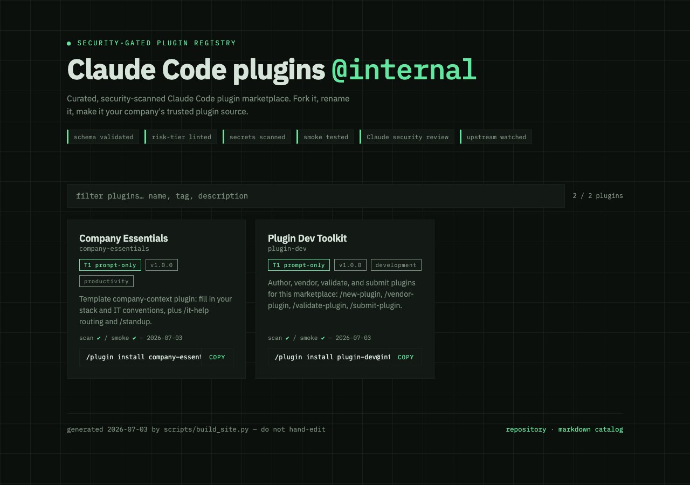

# Claude Code Plugin Marketplace

**A safe "app store" for your team's Claude Code — with the safety checks built in.**

[](https://github.com/francobee/claude-plugin-marketplace/actions/workflows/pages.yml)
[](docs/SECURITY.md)
[](LICENSE)
[](https://github.com/new?template_name=claude-plugin-marketplace&template_owner=francobee)
[](https://francobee.github.io/claude-plugin-marketplace/)
[](CONTRIBUTING.md)

Plugins give Claude Code superpowers — but they run inside people's sessions with their permissions, and they auto-update. One bad plugin ships to everyone. This project is a plugin marketplace **plus the pipeline that makes it trustworthy**: every change is schema-validated, risk-linted, secrets-scanned, smoke-tested, and reviewed by Claude for prompt injection before a human approves the merge. Then it maintains itself.

[](https://francobee.github.io/claude-plugin-marketplace/)

## Pick your path

| You want to… | Start here | Time |
|---|---|---|
| 📦 **Install plugins** from a marketplace | [Use it](#-use-it) | 1 minute |
| 🏢 **Run a marketplace for your company** | [Set up your own](#-set-up-your-own) | ~10 minutes |
| 🧩 **Write or import a plugin** | [Add a plugin](#-add-a-plugin) | ~15 minutes |
| 💜 **Improve this project** | [CONTRIBUTING.md](CONTRIBUTING.md) — **maintainers wanted** | any amount helps |

New to all of this? The [beginner guide](docs/GETTING-STARTED.md) assumes zero prior knowledge and walks every role through in plain language.

## 📦 Use it

<!-- gen:readme-quickstart -->
**Use this marketplace:**

```bash
# inside Claude Code
/plugin marketplace add francobee/claude-plugin-marketplace
/plugin install plugin-dev@internal
```
<!-- /gen:readme-quickstart -->

That's it. Plugins auto-update when the marketplace publishes changes — you never re-install. Browse what's available on the [catalog site](https://francobee.github.io/claude-plugin-marketplace/) or in [CATALOG.md](CATALOG.md).

## 🏢 Set up your own

The **`/setup` wizard does everything** — creates your private company repo from this template, interviews you in plain English (no YAML knowledge needed), protects the main branch, enables the catalog site, and hands you a health checklist:

```bash
# inside Claude Code
/plugin marketplace add francobee/claude-plugin-marketplace
/plugin install marketplace-admin@internal
/setup
```

Prefer other routes? `./init.sh` is the offline fallback (five questions), the [beginner guide](docs/GETTING-STARTED.md#part-4--setting-up-your-own-marketplace-admin) has the click-by-click manual path, and [AGENTS.md](AGENTS.md) is a machine-readable runbook you can paste into any AI agent.

**After setup, everything company-specific lives in one file: `marketplace.config.yml`.** Edit it, run `python3 scripts/apply_config.py`, open a PR — every derived file (catalog, docs, CODEOWNERS, device payloads) regenerates, and CI rejects hand-edited rendered values. When something breaks, it breaks loudly *for you* and silently *for your users*: every failure has an error code ([docs/TROUBLESHOOTING.md](docs/TROUBLESHOOTING.md)) and auto-files a deduped GitHub issue.

**Where does the catalog site live?** Your choice of free option: GitHub Pages (public repos) or Cloudflare Pages (free even for private repos) — one config value, walkthrough in [docs/HOSTING.md](docs/HOSTING.md). Or no site at all: [CATALOG.md](CATALOG.md) always works.

**Rolling Claude Code out to managed devices** (JumpCloud, Jamf, Intune, Kandji)? [docs/FLEET.md](docs/FLEET.md) — install, policy, credentials, and scheduled health checks, all generated from the same config.

## 🧩 Add a plugin

```bash
/plugin install plugin-dev@internal    # inside Claude Code, from your marketplace
/new-plugin my-idea                    # scaffold (or /vendor-plugin <github-url> to import)
# …edit, test with: claude --plugin-dir plugins/my-idea
/submit-plugin                         # branch, version, changelog, validation, PR — all handled
```

House rules (risk tiers, versioning, what CI rejects) are in [docs/AUTHORING.md](docs/AUTHORING.md). Importing someone else's plugin pins it to an exact commit and watches upstream weekly — see [docs/VENDORING.md](docs/VENDORING.md).

## 🛡️ What gets checked before anything ships

Every pull request runs eight checks; a human (CODEOWNERS) approves on top. No exceptions, including for the admins.

| Check | Catches |
|---|---|
| Manifest validation | Broken/missing metadata, catalog inconsistencies |
| Version + changelog gate | Silent changes shipping without a version bump |
| Secrets scan (gitleaks) | Committed tokens and keys |
| Risk lint | Dangerous patterns, hidden Unicode, undeclared risk tiers, network calls outside your allowlist |
| Smoke test | Structurally broken plugins that would merge fine and fail on install |
| Config drift | Hand-edits to generated files |
| Claude security review | Prompt injection, data exfiltration, hidden instructions in the diff |
| Permission manifest | Posts what the plugin *actually* touches (commands, endpoints, MCP servers) as a PR comment, next to what the author *claims* |

Honest threat model, including what this can't catch: [docs/SECURITY.md](docs/SECURITY.md).

## 💜 Contributing & maintainers

This project wants your help — and not just code:

- **Plugins** — the catalog grows one `/submit-plugin` at a time.
- **Product** — scripts, CI, fleet payloads, the admin wizard. Small stdlib-only Python and bash; `scripts/test_all.sh` is the whole test suite.
- **Docs** — if anything in here confused you, that's a bug; a PR that says it simpler is a fix.
- **Maintainers** — we're actively looking for co-maintainers to review plugin submissions, triage issues, and steward releases. Raise your hand by opening an issue titled `maintainer: <your handle>`.

Start at [CONTRIBUTING.md](CONTRIBUTING.md). Be kind: [CODE_OF_CONDUCT.md](CODE_OF_CONDUCT.md).

## Repo map

| Path | Purpose |
|---|---|
| `marketplace.config.yml` | **Single source of truth** — all company-specific values |
| `.claude-plugin/marketplace.json` | The catalog (rendered from config + plugin entries) |
| `errors.json` | Error registry: every failure mode → code, impact, fix |
| `plugins/` | One directory per plugin (+ `.upstream.json` / `.scorecard.json` sidecars) |
| `scripts/` | The gate + the machinery: validate, risk lint, versions, smoke test, LLM review, scorecard, catalog, site, scaffold, vendor import, upstream watch, apply_config, notify, test_all |
| `templates/` | Partials rendered into docs and fleet payloads by apply_config.py |
| `fleet/` | Generated MDM payloads: managed settings + JumpCloud lifecycle scripts |
| `.github/workflows/` | pr-validation (8-check gate), post-merge (render/catalog/site/scorecards/announce), upstream-watch (weekly), pages + site-cloudflare (site deploy, gated by `site.hosting`) |
| `docs/` | The guides (see below) |
| `AGENTS.md` / `CLAUDE.md` | Runbooks + rules for AI agents working in this repo |
| `init.sh` | Offline bootstrap fallback (writes marketplace.config.yml) |

## Docs

| Doc | Read it when |
|---|---|
| [GETTING-STARTED](docs/GETTING-STARTED.md) | You're new — the whole concept, setup, daily use, admin ops |
| [AUTHORING](docs/AUTHORING.md) | You're writing a plugin — tiers, versioning, what CI rejects |
| [VENDORING](docs/VENDORING.md) | You're importing a third-party plugin |
| [SECURITY](docs/SECURITY.md) | You want the threat model and the honest caveats |
| [HOSTING](docs/HOSTING.md) | You're choosing where the catalog site lives (GitHub Pages / free Cloudflare / none) |
| [FLEET](docs/FLEET.md) | You're rolling out to managed machines (MDM) |
| [TROUBLESHOOTING](docs/TROUBLESHOOTING.md) | Something failed with an error code (generated from errors.json) |
| [UPDATING](docs/UPDATING.md) | Your instance repo wants the latest template release |
| [CONTRIBUTING](CONTRIBUTING.md) | You want to improve the project (or become a maintainer!) |

## Seed plugins

- **company-essentials** — template company-context plugin (`/it-help`, `/standup`, company-context skill). Fill in and make it yours.
- **plugin-dev** — `/new-plugin`, `/vendor-plugin`, `/validate-plugin`, `/submit-plugin` + the authoring house-rules skill.
- **marketplace-admin** — `/setup` (instance-creation wizard) + `/status` (installation health checklist) + the admin ops skill.

## Roadmap

Designed and specified, shipping next (in order): pseudonymous **usage analytics** + Grafana fleet dashboard (metrics-only, never logs) → first-class **agent/hook/template taxonomy** → **trending-plugin digest** with one-command vendoring → `/update-marketplace` one-command template updates (the manual flow works today: [docs/UPDATING.md](docs/UPDATING.md)).

MIT licensed. Built with Claude Code.
